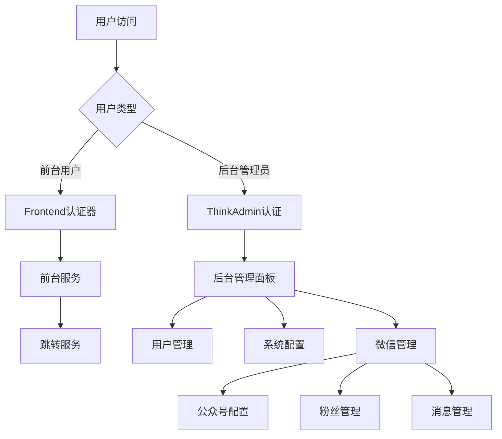

# 微信自动跳转后端系统产品需求文档

## 1. Product Overview

**微信自动跳转后端系统是一个基于ThinkPHP 6框架开发的Web管理平台，集成ThinkAdmin管理系统和微信开发插件，提供前台用户和后台管理员的双重认证体系，支持微信公众号/小程序开发和管理功能。**

* 解决微信跳转场景下的用户认证和权限管理问题，为前台用户提供便捷的服务访问，为后台管理员提供完整的系统管理功能。

* 目标是构建一个基于ThinkAdmin框架的高性能、易维护的微信管理系统，支持快速业务扩展和模块化开发。

## 2. Core Features

### 2.1 User Roles

| Role          | Registration Method | Core Permissions         |
| ------------- | ------------------- | ------------------------ |
| Frontend User | 微信授权登录/手机号注册        | 访问前台API、查看个人信息、使用跳转服务    |
| Backend Admin | 管理员邀请码注册            | 管理用户、系统配置、查看统计数据、API文档管理 |

### 2.2 Feature Module

我们的后端系统包含以下主要功能模块：

1. **用户认证模块**：前台用户认证、后台管理员认证、Session会话管理
2. **用户管理模块**：用户信息管理、权限控制、角色分配（基于ThinkAdmin RBAC）
3. **微信管理模块**：微信公众号配置、粉丝管理、消息推送、菜单管理
4. **系统管理模块**：系统配置、操作日志、文件管理、队列管理
5. **跳转服务模块**：微信跳转逻辑、链接管理、访问统计

### 2.3 Page Details

| Page Name | Module Name | Feature description      |
| --------- | ----------- | ------------------------ |
| 用户认证模块    | Frontend认证器 | 处理前台用户登录、注册、Session会话管理    |
| 用户认证模块    | Backend认证器  | 处理后台管理员登录、权限验证、ThinkAdmin认证 |
| 用户管理模块    | 用户信息管理      | 创建、查询、更新、删除用户信息，支持批量操作   |
| 用户管理模块    | 权限控制        | 基于ThinkAdmin RBAC权限系统，权限分配和验证 |
| 微信管理模块    | 公众号配置       | 微信公众号参数配置、开发者配置、支付配置     |
| 微信管理模块    | 粉丝管理        | 微信粉丝信息管理、标签管理、群发消息       |
| 微信管理模块    | 消息管理        | 关键字回复、自动回复、素材管理          |
| 系统管理模块    | 配置管理        | 系统参数配置、数据字典、系统变量管理       |
| 系统管理模块    | 日志管理        | 操作日志记录、系统日志查看、用户行为分析     |
| 跳转服务模块    | 链接管理        | 创建、管理跳转链接，支持短链接生成        |
| 跳转服务模块    | 访问统计        | 跳转次数统计、用户来源分析、热门链接排行     |

## 3. Core Process

**Frontend User Flow:**
用户通过微信授权或手机号注册 → 建立Session会话 → 访问前台服务 → 使用跳转功能 → 查看个人统计数据

**Backend Admin Flow:**
管理员账号登录 → ThinkAdmin认证验证 → 访问后台管理面板 → 管理用户和系统配置 → 管理微信公众号和粉丝



## 4. User Interface Design

### 4.1 Design Style

* 主色调：#1890FF (蓝色)，辅助色：#52C41A (绿色)

* 按钮样式：圆角按钮，支持悬停效果

* 字体：系统默认字体，标题16px，正文14px，小字12px

* 布局风格：卡片式布局，顶部导航栏

* 图标风格：简洁线性图标，支持主题色填充

### 4.2 Page Design Overview

| Page Name | Module Name | UI Elements                   |
| --------- | ----------- | ----------------------------- |
| 后台管理      | ThinkAdmin界面 | LayUI框架，左侧菜单树，右侧内容区，面包屑导航     |
| 管理后台      | 用户管理界面      | LayUI表格，搜索筛选栏，操作按钮组，分页组件      |
| 微信管理      | 粉丝管理        | 数据表格，标签管理，批量操作，实时同步功能        |
| 微信管理      | 消息管理        | 富文本编辑器，素材选择器，关键字配置，预览功能      |
| 认证页面      | 登录界面        | 居中表单，简洁输入框，ThinkAdmin品牌，验证码    |

### 4.3 Responsiveness

系统采用桌面优先设计，基于LayUI响应式框架，支持移动端自适应，后台管理界面优化触摸交互体验。

## 5. Technical Architecture

### 5.1 Technology Stack

* **后端框架**: ThinkPHP 6.0
* **管理系统**: ThinkAdmin (zoujingli/thinkadmin)
* **微信开发**: think-plugs-wechat 插件
* **支付系统**: think-plugs-payment 插件
* **用户系统**: think-plugs-account 插件
* **前端框架**: LayUI + jQuery
* **数据库**: MySQL 5.7+
* **缓存**: Redis/File Cache
* **队列**: Think-Queue

### 5.2 Module Structure

```
app/
├── admin/          # 后台管理模块
│   ├── controller/ # 控制器
│   ├── view/       # 视图模板
│   └── Service.php # 服务注册
├── wechat/         # 微信管理模块
│   ├── controller/ # 微信控制器
│   ├── service/    # 微信服务
│   ├── model/      # 数据模型
│   └── view/       # 微信视图
└── index/          # 前台模块
    └── controller/ # 前台控制器
```

### 5.3 Database Design

主要数据表包括：
* `system_user` - 系统用户表
* `system_auth` - 权限管理表
* `system_menu` - 菜单管理表
* `wechat_fans` - 微信粉丝表
* `wechat_keys` - 关键字回复表
* `account_user` - 前台用户表
* `payment_record` - 支付记录表
